# 6x Labs Platform

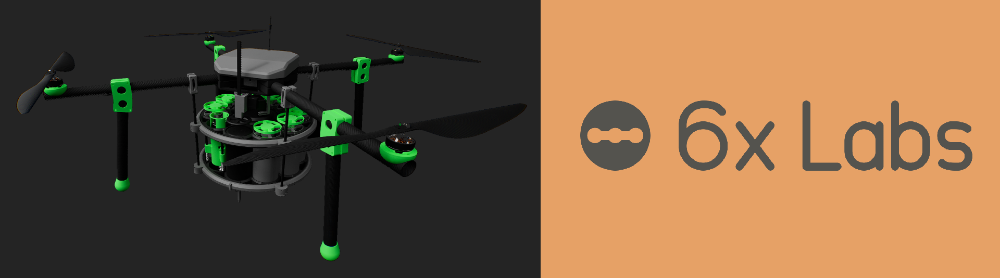

This project is an interactive platform for the drone reforestation enterprise 6x Labs. This platform is designed to plan and store reforestation project data as well as display detailed carbon sequestration information for the customer. The projects planned here will eventually be planted using drones in the real world.

From a users perspective, they should be able to view reforestation projects planned and run by 6x Labs, and, if they are registered user, they can create, edit and delete Projects.

In terms of design, a modern and minimalistic colour theme was chosen in order to streamline the UX and keep the focus on the raw data. This design is reflected across the whole site. The site UX is inspired by platforms such as Notion, ensuring a modern and easy to use interface.

A responsive site layout enables easy navigation on all devices.

## Desktop

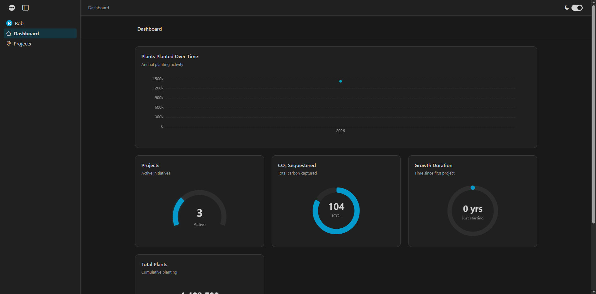

## Tablet

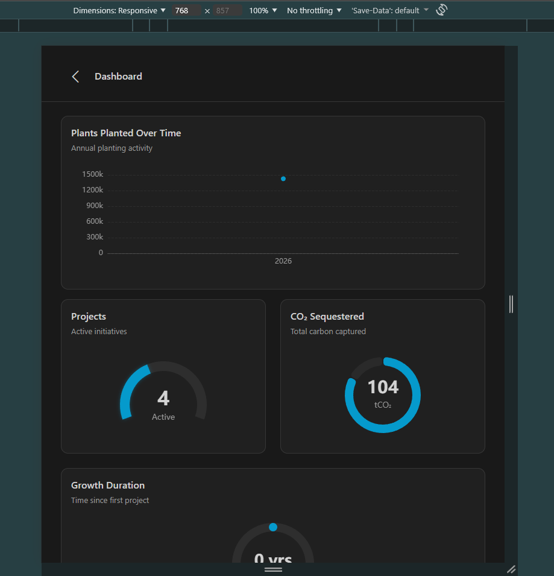

## Mobile

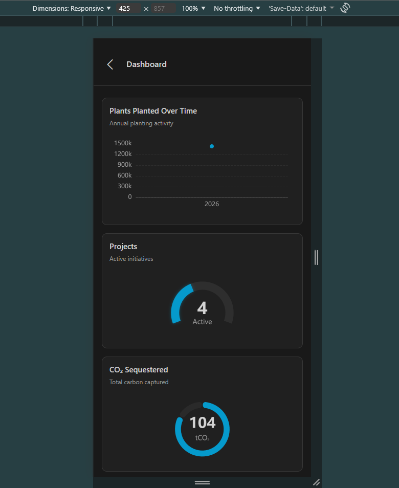

## UX Design

### Typography

[**Bootstrap icons**](https://icons.getbootstrap.com/) icons were used for all icons across the site to ensure consistency and reduce dependency on custom made icons.

**Segoe UI** was used for the all text across the site as it is a default browser font meaning no font packages needed to be bundled with the deployment. Font weights were used to define headers and body text. This design choice was made to keep the site art style minimal and clean.

Fallback fonts are also used if this font is not available based on the users OS type.

### Company branding ###
The 6x Labs branding is used to inform the minimalist UX. This orange was not implemented in the final site colour palette.

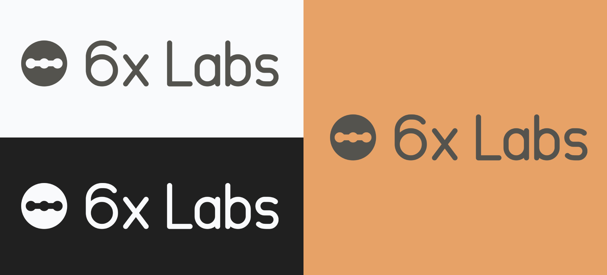

### Colour Palette ###
The website uses a "default" colour palette that contains a light and dark version of the theme. These were deliberately chosen to be minimalist and simple. The primary colours are only used on significant buttons, navigation links and the user avatar.

**Light mode:**

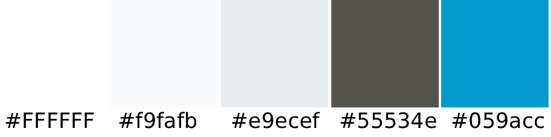

**Dark mode:**

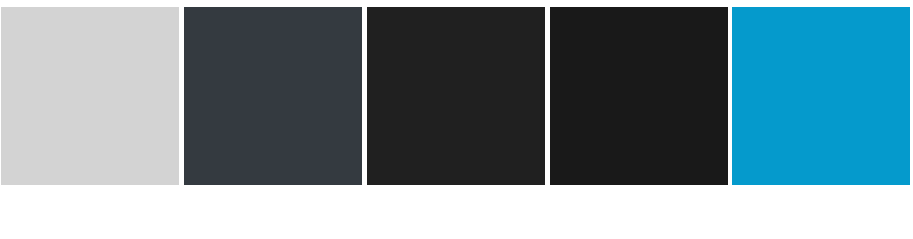

### Theme select ###

During onboarding the user can select from a choice of themes that utilise these same minimalist principles. Each theme has different overall shades but still tries to keep the colour choices focused on the primary colour being the only accent visible. For the sake of this readme, we will assume the user has chosen the default theme.

The darker red themes of Sunset and Honeycomb are currently WIP and will be updated in the future to be more accessible and include higher contrast colours.

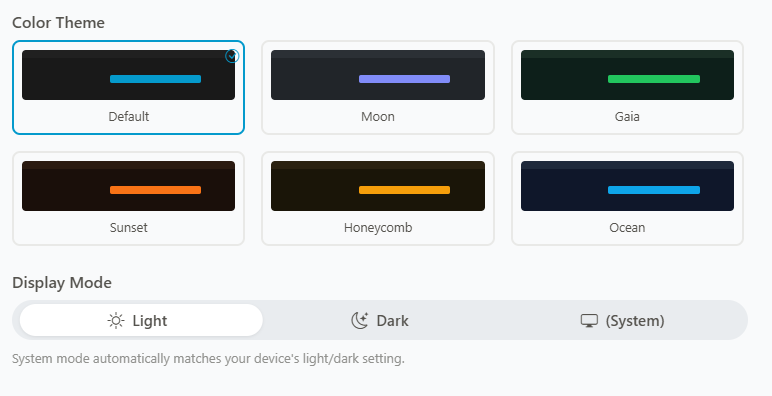

### Dark/Light mode toggle ###

Each theme has been configured with a light and dark mode, which can be triggered using the toggle within the navigation bar.

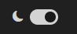

**Final render light mode:**

**Final render dark mode:**

### Wireframes ###
Traditional 2D wireframes were not used in the developement process. Instead, a more accurate, iterative design methodology was chosen by using Figma AI to rapidly prototype the overall look and feel of the website wireframes.

You can find the interactive Figma wireframe [**here**](https://www.figma.com/make/jcqTNS8Q5eVMfk0JePleqs/Project-Creation-Page?p=f)

The benefit of using an interative design tool in this way is that the website layout could be updated and reverted quickly, allowing multiple versions to be tested out before being developed. Additionally buttons and functionality can be previewed to get a better understanding of the real UX that the user will perform. Finally, the CSS and base functionality can be extracted, allowing a much faster design loop than traditional wireframing.

### Main project page Wireframe Design

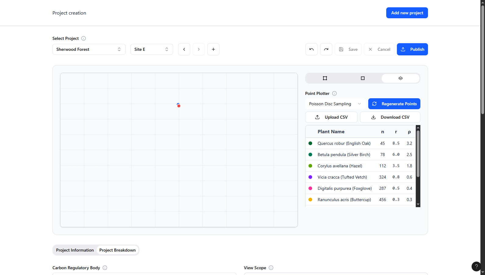

### Main project info Wireframe Design

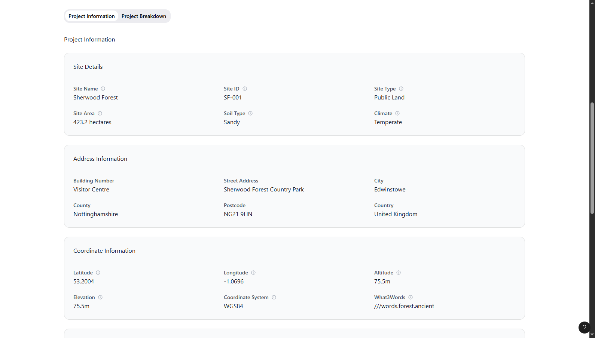

### Main project breakdown Wireframe Design

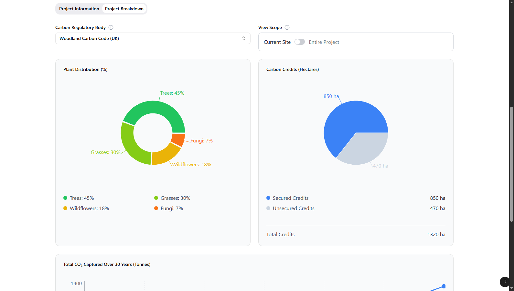

### Generic page template Wireframe Design

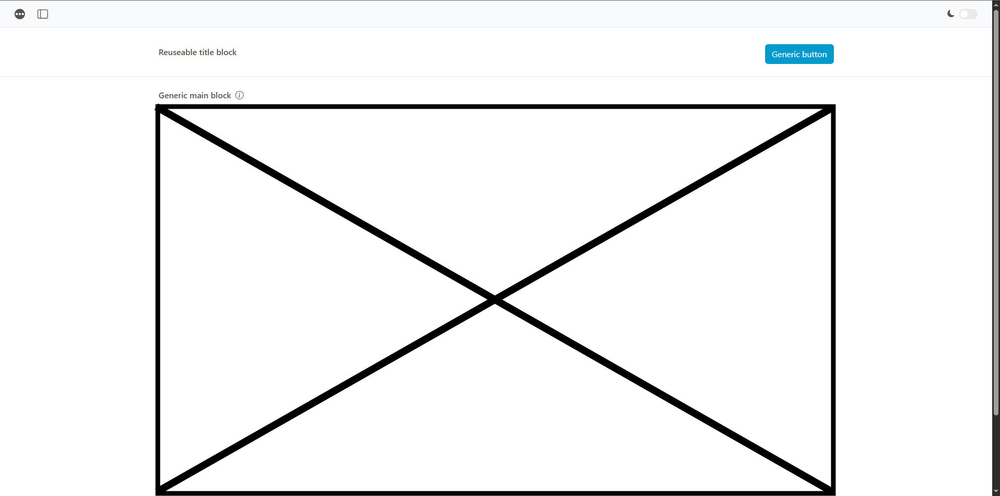

### Modal component Wireframe Design

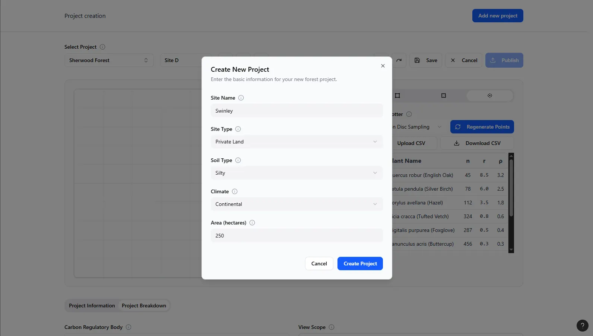

### Component inspiration
As the rest of the website is very minimalist, the design for certain aspects was taken from other SaaS platforms such as Notion. The login and sidebar UX was taken as inspiration.

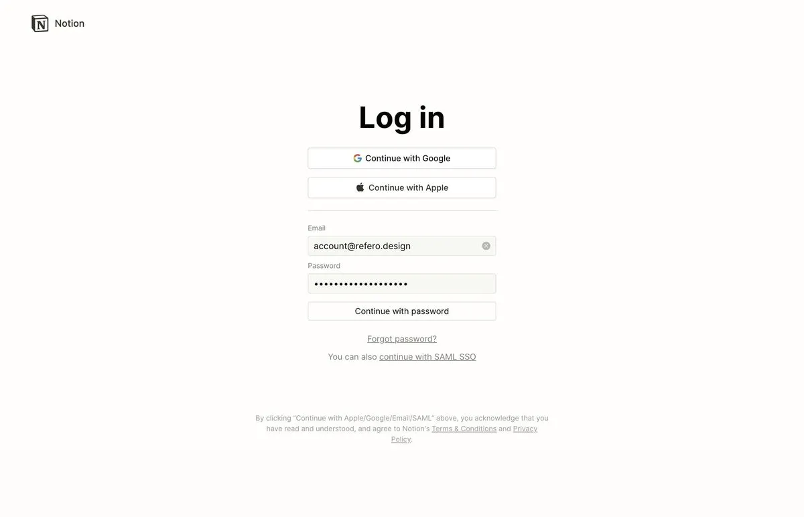

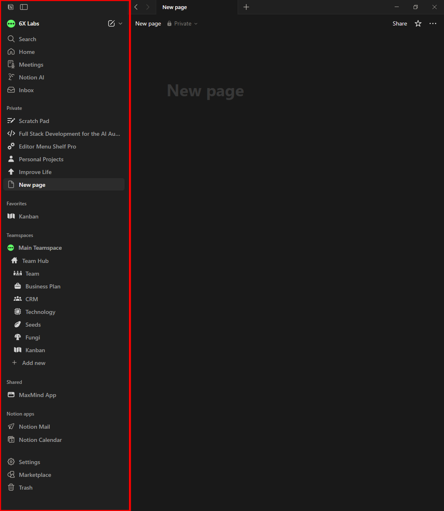

## User Stories

**As a site user, I can view a list of posts and click on the post I want to view.**

- A list of posts is displayed on the front page
- Multiple posts are listed and paginated

**As a Site User, I can click on a post so that I can read the full text.**

- When a blog post title is clicked, a detailed view of the individual post is displayed.

**As a Site Admin I can create draft posts so that I can finish writing the content later, prior to publishing.**

- As a logged in Admin, they can save a draft blog post
- As a logged in Admin they can finish the content at a later time

**As a Site User I can view comments on an individual post**

- Given one or more user comments the user can view them.
- Given one or more user comments the admin can view them.

**As a Site User I can leave comments on a post**

- Comments need to be approved by an admin user
- Approved comments are listed on the individual post page

**As a Site User I can modify or delete my comments on a post**

- A logged in user can modify their own comments
- A logged in user can delete their own comments

**As a site admin I can approve/disapprove comments in order to filter out objectionable comments**

- Admin can approve a comment
- Admin can un-approve a comment

**As a Site User, I can click on the About link and read about the site.**

- When the About link is clicked, the about page is displayed.

**As a Site Admin, I can create or update the about page.**

- The About app is visible in the admin panel
- The About app is accessible to Admin users

**As a site user I can fill in a contact /collaboration form so that I can submit a message to the site owner.**

- Contact/collaboration form is submitted and feedback given

**As a Site Admin I can mark contact messages as "read".**

- Admin can mark messages as read

**As a user I can click on the biography menu and read the band biography**

- User clicks biography and band biog page displays
- Admin can add/edit band biographies

**As a Site User I can register an account so that I can comment posts.**

- Given an email a user can register an account and log in.
- When the user is logged in they can comment.

**As a site user/admin I can login so that I can access all of available content.**

- User can login and se the full range of available menus.

**As a site user/admin I can logout so that I can leave the site safely.**

- User/admin can logout successfully

**As a site user I can view a list of past and present band events**

- User can view a list of events successfully

**As a site admin I can add events to a band event list.**

- Admin can add event items successfully

The completed sprint was composed of 17 separate items. Having used the MoSCoW approach to prioritisation, 9 were classified as "Must-Have" making up less than 60% of the tasks as recommended. The rest of the first sprint was made up of "Should-Have" and "Could-Have" items.
There were no remaining backlog items.

EXPLAIN HERE HOW I USED LINEAR AS ITS BETTER THAN GITHUB PROJECTS + I CAN CREATE A PARENT WITH MULTIPLE SUB ISSUSES TO TRACK LONGER TASKS
I have also used milestones as a way to track larger features of the overall project, most of which are outside of the scope of the capstone.

## Features

**Dashboard Page**

The dashboard page is home page of the platform per user, it is set up as the redirect for login. The dashboard features working graphs that showcase breakdown information about the ongoing projects. In the future these graphs will be configured towards each users specific projects and company carbon compliance information.

**Projects page**
 
The projects page provides users with a granular list or table view of the ongoing reforestation projects. Users can also sort projects by keywords using the search bar functionality. The table is also sortable by clicking on each heading. Only project owners, site staff or superusers will see the "actions" header in the table. This ensures projects cannot be deleted by the wrong users.

**Project planner page [Interactive 3D map]**
 
The project planner page automatically loads the project data and interactive map at the correct latitude and longitude. Projects can be navigated to by using the dropdown menu within the screen. This ensures the user does not need to go back to the projects list page. The "state managment" actions bar in the top right is currently under development and is hidden from all non-staff and super users. In future updates users will be able to undo, redo, save a draft, discard their changes and publish drafts to the platform. The state management queue system was outside of the scope of the MVP for this project so has been omitted for normal users.

The interactive map has three modes with the sidebar (Sites, Zones and point plotter). These modes are disabled for users currently as they are also under development. The intention is to allow users to draw out "sites" then draw out inclusion and exclusion zones with the site. Finally the point plotting system will spawn millions of points within the inclusion zones. The spawned points will be linked to a specific biodiversity species mix database. The table examples are showing within my wireframe examples.

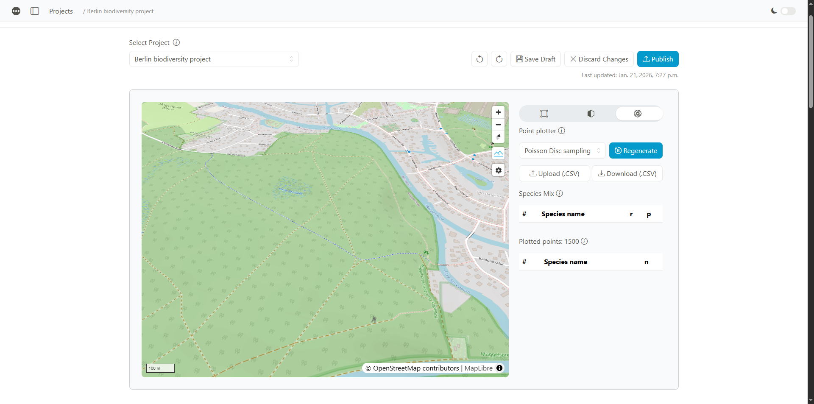

 
The visualisations below are working "point plotting" algorithms that have been developed using various computer science Python libraries and rendered with MatPlotLib. The long term goals of the platform is to generate these points on the interactive map and save them per site and per project. After iterating on the points and collaborating with the relevant forestry commission these points can be sent to a drone for future seed dispersal.
 
 

The red areas are "exclusion" zones and the white area is the overall "site". The points are spawned inside the "inclusion" zones. These would be used to define viable land to plant trees.

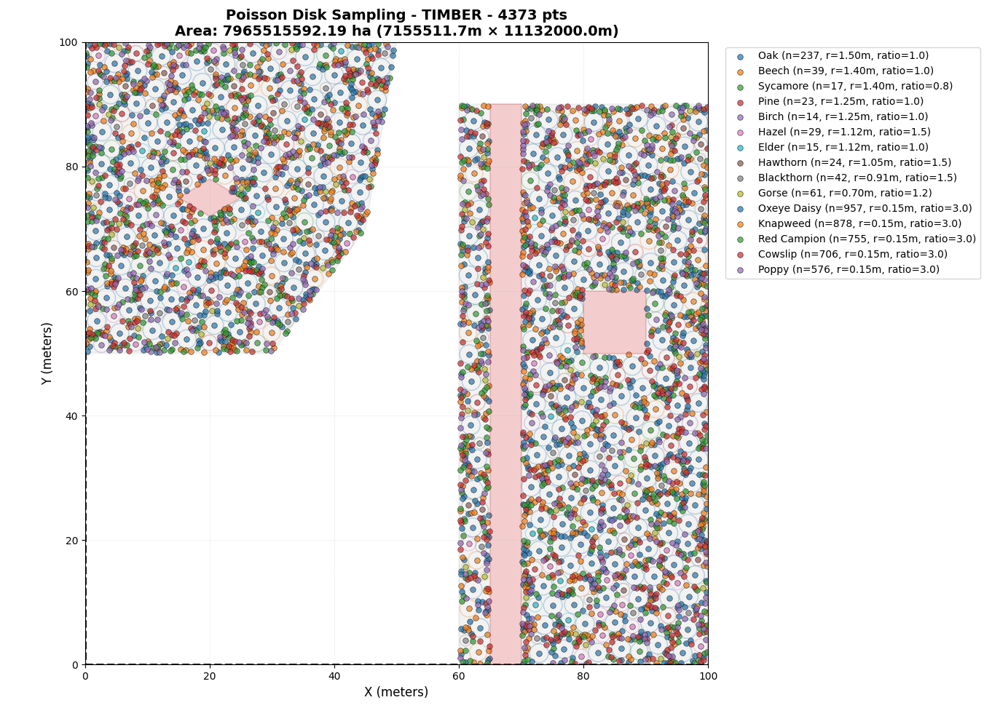

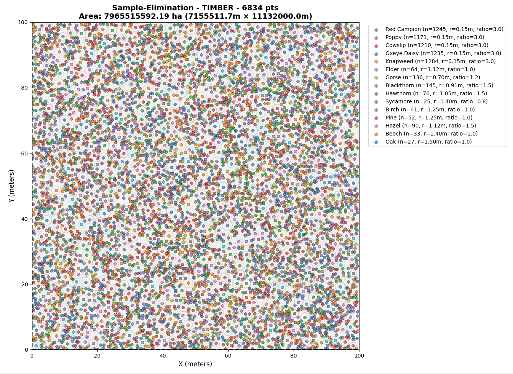

Under the "Reading regeneration charity forest" project there is a hardcoded visualisation concept of how these points will be rendered. This not an exposed feature for users.

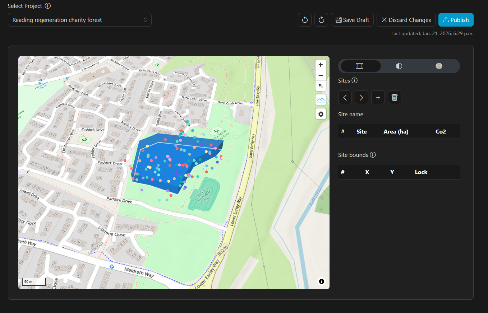

**Project planner page [Project info section]**
 
All of the project data is rendered using grouped "cards". Each card has a related edit button and the data per card can be configured within the projects model for easy updating.

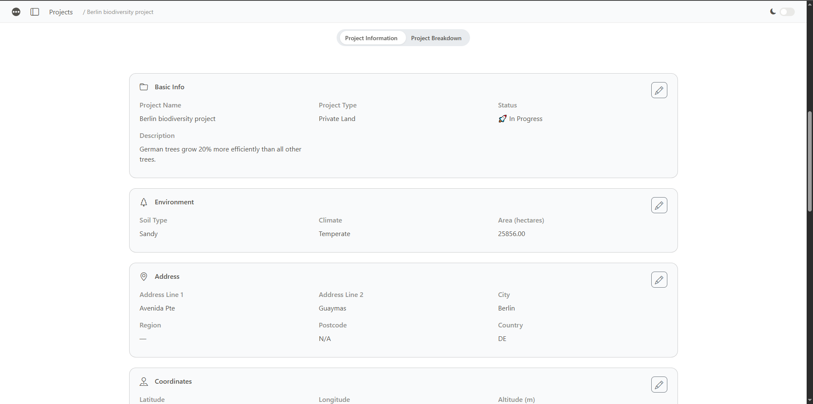

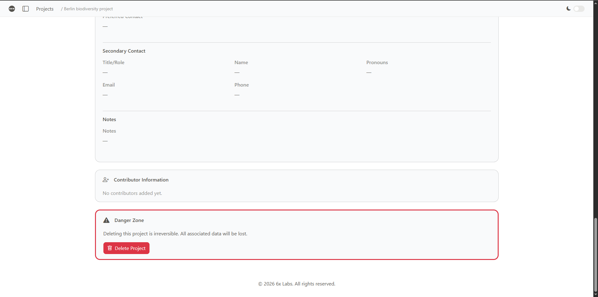

**Project planner page [Project breakdown section]**
 
PICTURE HERE OF NEW GRAPHS
The project breakdown section shows off the relevant data per project. All of the graphs automatically update and when the page is loaded. Therefore long term data can be studied as the reforestation project is updated.

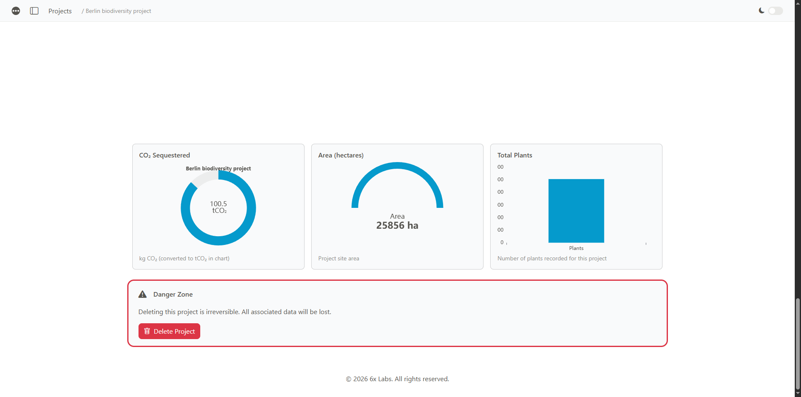

**Project creation flow**
 
The "Add new project" button is triggered from any project/ sub page. This project creation flow is build using a custom wizard component that allows any forms to be integrated as "steps". Each step is a separate form to allow flexible and customisable pages for various user interaction. This wizard is also used for the user onboarding and is designed in an agnostic way, allowing any type of form to be used.

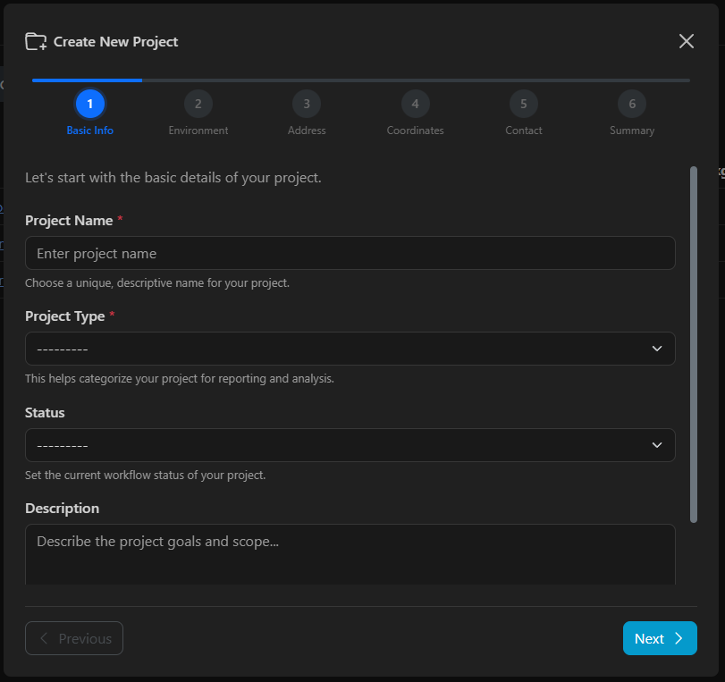

The wizard has two distinct modes, create and edit. The create mode omits autogenerated fields from each form. The edit mode loads existing data into the form and unhides autogenerated fields that are present within the project to not confuse the user. The autogenerated fields are disabled as the user should not edit them manually.

Allowing users to see the data within the projects info cards means they can edit specific groups of data at one time. The "card" they click on will automatically load the related edit form for that data. This keeps data handling consistent across the site and user journey.

**Data displayed in project environment "card"**

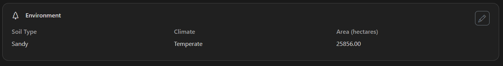

**Editable data in project environment form**

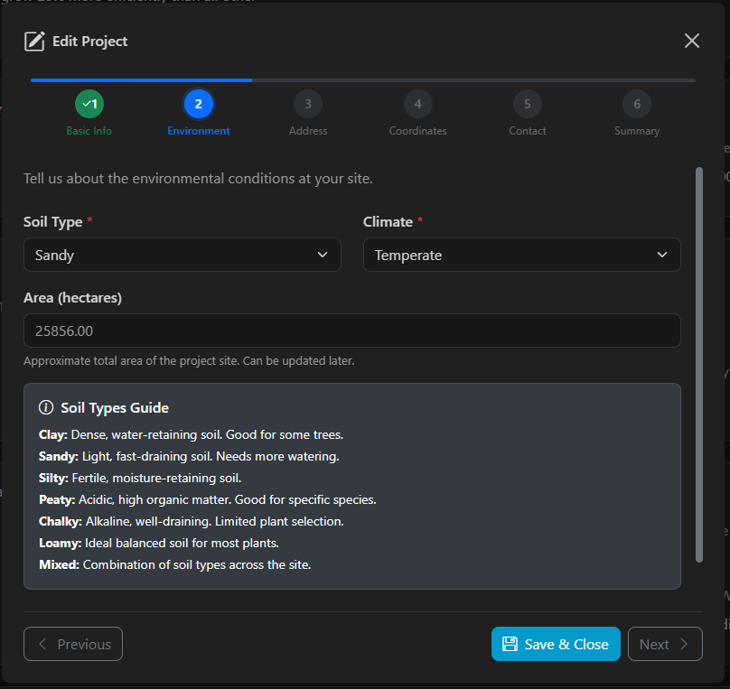

**Project deletion flow**
 
Projects can be deleted using the delete wizard which is designed to safely delete projects. It uses a 2 step form with a project name confirmation field. The additional data shows the user on the second page to ensure the correct user is deleting the project for audit trails.

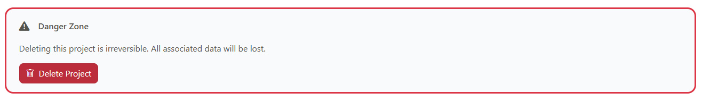

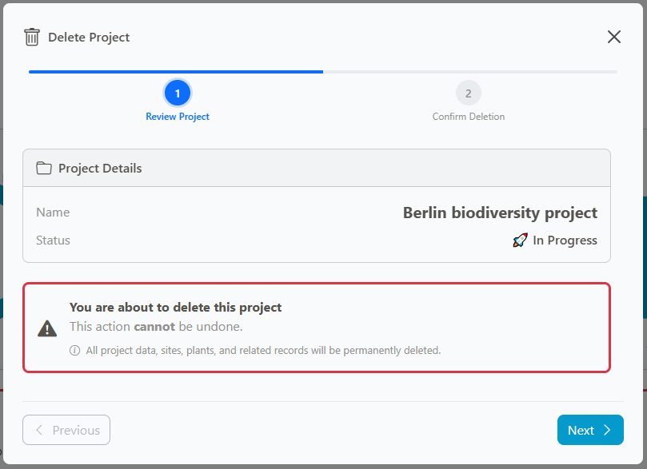

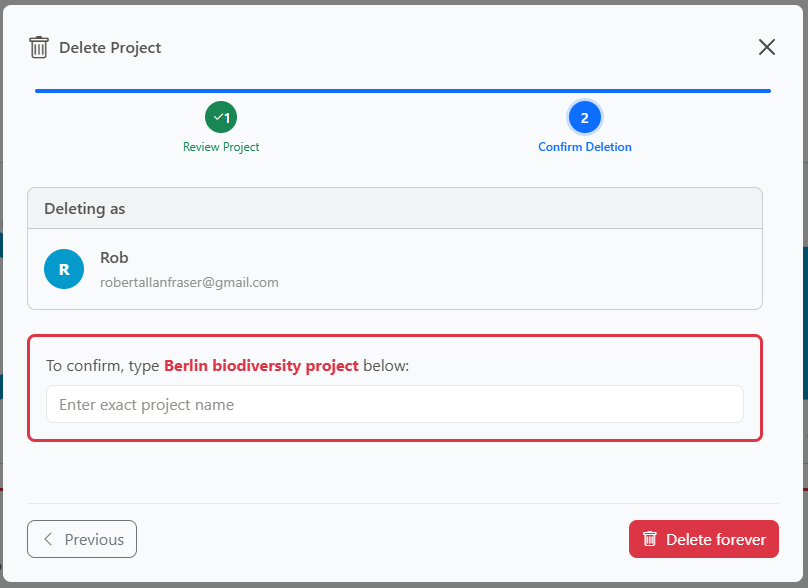

**Side Bar**

The sidebar is custom implementation of the bootstrap oncanvas component. The sidebar has been extended to allow for custom "nav-item" functionality per user. Currently the user is denied access to navigation items that are not accessible under the default subscription tier (Sapling). This is intentional as only subscribed users can access the premium pages.

The sidebar has custom CSS and JS functionality which stores the current sidebar side and hidden/unhidden preference per user within their user config. This is stored between pages to ensure a smoother user experience.

The sidebar also has expandable nav item folders which is designed to make navigation easier. In the future the currently open folders will persist across pages.
 

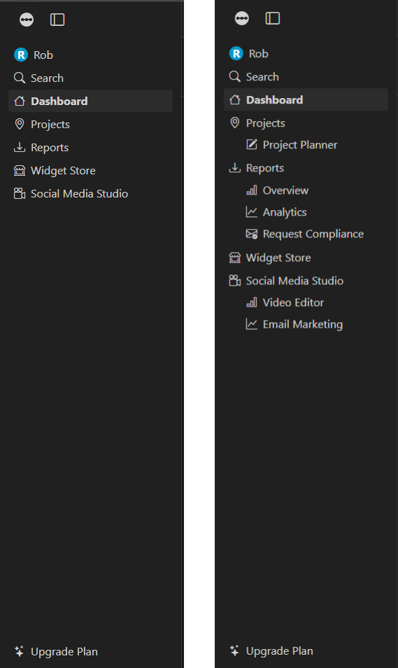

In mobile view the sidebar is rendered on top of the current page allowing easier selection by touch. This can be hidden/unhidden using the arrow in the top left.

**Navigation Bar**
The navigation bar is deliberately kept very simple and only includes breadcrumbs and the theme lightmode toggle. It is responsive to the sidebar being hidden/expanded. The sidebar button and 6x logo automatically hide/unhide from the sidebar into the nav components enforcing a smooth experience when hiding the sidebar.

  

**The Footer**
The footer is a simple copyright notice applied to each page. This can be overridden using the template footer block.

  

**Sign Up**

The site allows users to register as user. Users cannot access the site unless they are logged in with an authenticated account. 

  

**Log In**

The site allows users to log in to already registered accounts. You are redirected to the dashboard upon login.

  

**Onboarding**
The site uses an onboarding form to capture and update the users information

 

**Teamspace modal**

The site has a "teamspace" modal that can be opened via the sidebar by clicking on the user button. This shows the currently logged in user, their "subscription tier" (Defaults to "Sapling" due to a lack of payment system integration), their email and display name. The user can log out via this modal.

**Sign Out**

The site has a facility for a user to sign out of their account.

  

**Admin**

The site has a facility for designated administrators to sign in, in order to administrate the site via the standard Django admin interface.

 

**Entity Relationship Diagram**

The following database schema ERD was created for the project.

This is a simplified diagram explaining the core data models and how they relate. Not every table has been integrated, the data structure has been generated to future-proof the development.

## Testing

### Manual Testing
The site was tested on the following browsers for compatibility:

### Chrome ###
|   Test	|  Expected Result 	|  Actual Result	|
|---	|---	|---	|
|   Click Home menu	|  success 	|  success 	|
|   Click About menu	|  success 	|  success 	|
|   Click Biogs menu	|  success 	|  success 	|
|   Click Admin menu	|  success 	|  success 	|
|   Click Login menu	|  success 	|  success 	|
|   Click Logout	|  success 	|  success 	|
|   Click individual blog post	|  success 	|  success 	|
|   Create, edit, delete a personal comment	|  success 	|  success 	|
|   Register new account	|  success 	|  success 	|
|   Create collaboration request	|  success 	|  success 	|
|   Access admin interface	|  success 	|  success 	|
|   Responsivity	|  success 	|  success 	|
|   Open new page from social media links	|  success 	|  success 	|

### Firefox ###
|   Test	|  Expected Result 	|  Actual Result	|
|---	|---	|---	|
|   Click Home menu	|  success 	|  success 	|
|   Click About menu	|  success 	|  success 	|
|   Click Biogs menu	|  success 	|  success 	|
|   Click Admin menu	|  success 	|  success 	|
|   Click Login menu	|  success 	|  success 	|
|   Click Logout	|  success 	|  success 	|
|   Click individual blog post	|  success 	|  success 	|
|   Create, edit, delete a personal comment	|  success 	|  success 	|
|   Register new account	|  success 	|  success 	|
|   Create collaboration request	|  success 	|  success 	|
|   Access admin interface	|  success 	|  success 	|
|   Responsivity	|  success 	|  success 	|
|   Open new page from social media links	|  success 	|  success 	|

### Edge ###
|   Test	|  Expected Result 	|  Actual Result	|
|---	|---	|---	|
|   Click Home menu	|  success 	|  success 	|
|   Click About menu	|  success 	|  success 	|
|   Click Biogs menu	|  success 	|  success 	|
|   Click Admin menu	|  success 	|  success 	|
|   Click Login menu	|  success 	|  success 	|
|   Click Logout	|  success 	|  success 	|
|   Click individual blog post	|  success 	|  success 	|
|   Create, edit, delete a personal comment	|  success 	|  success 	|
|   Register new account	|  success 	|  success 	|
|   Create collaboration request	|  success 	|  success 	|
|   Access admin interface	|  success 	|  success 	|
|   Responsivity	|  success 	|  success 	|
|   Open new page from social media links	|  success 	|  success 	|

### Safari ###
|   Test	|  Expected Result 	|  Actual Result	|
|---	|---	|---	|
|   Click Home menu	|  success 	|  success 	|
|   Click About menu	|  success 	|  success 	|
|   Click Biogs menu	|  success 	|  success 	|
|   Click Admin menu	|  success 	|  success 	|
|   Click Login menu	|  success 	|  success 	|
|   Click Logout	|  success 	|  success 	|
|   Click individual blog post	|  success 	|  success 	|
|   Create, edit, delete a personal comment	|  success 	|  success 	|
|   Register new account	|  success 	|  success 	|
|   Create collaboration request	|  success 	|  success 	|
|   Access admin interface	|  success 	|  success 	|
|   Responsivity	|  success 	|  success 	|
|   Open new page from social media links	|  success 	|  success 	|

### Lighthouse
The site was tested using Lighthouse with the following results:

### Responsive Testing

Alongside the built in Bootstrap responsive CSS, Chrome dev tools were used frequently to test the site at standard screen sizes and the site was manually viewed on laptops, tablets and phones.

### Validator Testing

- HTML

  - No errors were returned when passing through the official W3C validator

- CSS
  - No errors were found with our own CSS code when passing through the official Jigsaw validator.

- Python

  - All Python code was tested for PEP8 compatibility with the Code Institute Linter.

  **The only code that didn't pass was code that was automatically generated by Django**
  
  which was then edited in order to pass.

  

  - Javascript

  - All Javascript code was tested for errors with JSHint. There were no code errors and one error related to imported code, which is outside the domain of the test.
  
  

## Deployment

The site was deployed to Heroku from the main branch of the repository early in the development stage for continuous deployment and checking.

The Heroku app is setup with 3 environment variables, repalcing the environment variables stored in env.py (which doesn't get pushed to github).

In order to create an Heroku app:

1. Click on New in the Heroku dashboard, and Create new app from the menu dropdown.

2. Give your new app a unique name, and choose a region, preferably one that is geographically closest to you.

3. Click "Create app"

4. In your app settings, click on "Reveal Config Vars" and add the environment variables for your app. These are:
- DATABASE_URL - your database connection string
- SECRET_Key - the secret key for your app
- CLOUDINARY_URL - the cloudinary url for your image store

The PostgreSQL database is served from ElephantSQL

Once the app setup is complete, click on the Deploy tab and:

1. connect to the required GitHub account
2. select the repository to deploy from
3. click the Deploy Branch button to start the  deployment.
4. Once deployment finishes the app can be launched.

The live link can be found [_here_](https://broken-lines-blog-d7e7160138f2.herokuapp.com/)

## Credits
- This project is based on the "I Think Therefore I Blog" project from the LMS.
  
### Content

- all content is copyright Broken Lines Publishing Limited 2024.
- The posts were created by various members of the band.

### Media

- For this project, all media was supplied by Broken Lines.
