# 6x Labs Platform

This project is an platform for the drone reforestation enterprise 6x Labs. This platform is designed to plan and store reforestation project data as well as display detailed carbon sequestration information for the customer.

From a user's perspective, they should be able to view reforestation projects, and, if they are a registered user, they can create, edit and delete Projects.

In terms of design, a modern and minimalistic colour theme was chosen in order to streamline the UX and keep the focus on the raw data. This design is reflected across the whole site. The site UX is inspired by platforms such as Notion, ensuring a modern and easy to use interface.

A responsive site layout enables easy navigation on all devices.

### Table of contents

- [Desktop](#desktop)
- [Tablet](#tablet)
- [Mobile](#mobile)
- [UX Design](#ux-design)
  - [Typography](#typography)
  - [Company branding](#company-branding)
  - [Colour Palette](#colour-palette)
  - [Theme select](#theme-select)
  - [Dark/Light mode toggle](#darklight-mode-toggle)
  - [Wireframes](#wireframes)
  - [Main project page Wireframe Design](#main-project-page-wireframe-design)
  - [Main project info Wireframe Design](#main-project-info-wireframe-design)
  - [Main project breakdown Wireframe Design](#main-project-breakdown-wireframe-design)
  - [Generic page template Wireframe Design](#generic-page-template-wireframe-design)
  - [Modal component Wireframe Design](#modal-component-wireframe-design)
  - [Component inspiration](#component-inspiration)
- [User Stories](#user-stories)
- [Features](#features)
- [Testing](#testing)
  - [Manual Testing](#manual-testing)
  - [Chrome](#chrome)
  - [Edge](#edge)
  - [Lighthouse](#lighthouse)
  - [Responsive Testing](#responsive-testing)
  - [Validator Testing](#validator-testing)
  - [HTML](#html)
  - [CSS](#css)
- [Deployment](#deployment)

## Desktop

## Tablet

## Mobile

## UX Design

### Typography

[**Bootstrap icons**](https://icons.getbootstrap.com/) were used for all icons across the site to ensure consistency and reduce dependency on custom made icons.

**Segoe UI** was used for all text across the site as it is a default browser font, meaning no font packages needed to be bundled with the deployment. Font weights were used to define headers and body text. This design choice was made to keep the site art style minimal and clean.

Fallback fonts are also used if this font is not available based on the user's OS type.

### Company branding ###
The 6x Labs branding is used to inform the minimalist UX. This orange was not implemented in the final site colour palette.

### Colour Palette ###
The website uses a "default" colour palette that contains a light and dark version of the theme. These were deliberately chosen to be minimalist and simple. The primary colours are only used on significant buttons, navigation links and the user avatar.

**Light mode:**
 

**Dark mode:**
 

### Theme select ###

During onboarding the user can select from a choice of themes that utilise these same minimalist principles. Each theme has different overall shades but still tries to keep the colour choices focused on the primary colour being the only accent visible. For the sake of this readme, we will assume the user has chosen the default theme.

The darker red themes of Sunset and Honeycomb are currently WIP and will be updated in the future to be more accessible and include higher contrast colours.
 

### Dark/Light mode toggle ###

Each theme has been configured with a light and dark mode, which can be triggered using the toggle within the navigation bar.

**Final render light mode:**
 
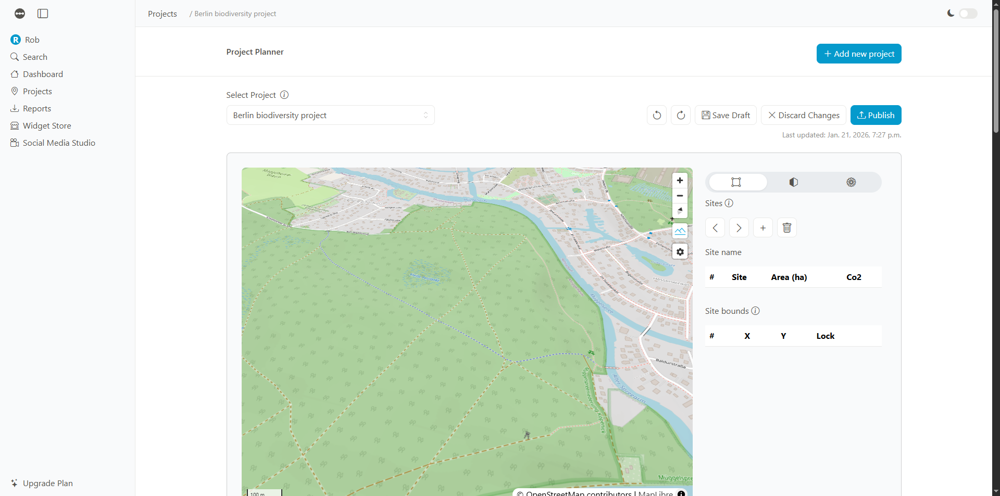

**Final render dark mode:**
 
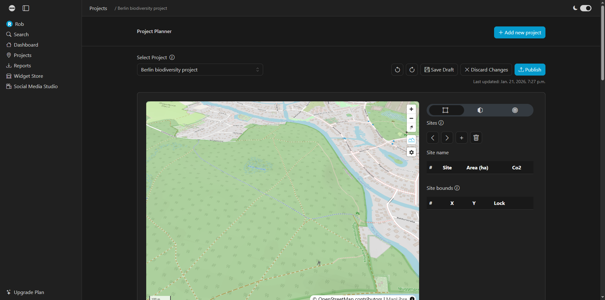

### Wireframes ###
Traditional 2D wireframes were not used in the development process. Instead, a more accurate, iterative design methodology was chosen by using Figma AI to rapidly prototype the overall look and feel of the website wireframes.

You can find the interactive Figma wireframe [**here.**](https://www.figma.com/make/jcqTNS8Q5eVMfk0JePleqs/Project-Creation-Page?p=f)

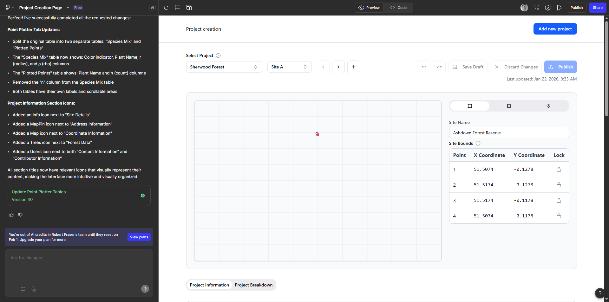

The benefit of using an iterative design tool in this way is that the website layout could be updated and reverted quickly, allowing multiple versions to be tested out before being developed. Additionally buttons and functionality can be previewed to get a better understanding of the real UX that the user will perform. Finally, the CSS and base functionality can be extracted, allowing a much faster design loop than traditional wireframing.

### Main project page Wireframe Design

### Main project info Wireframe Design

### Main project breakdown Wireframe Design

### Generic page template Wireframe Design

### Modal component Wireframe Design

### Component inspiration
As the rest of the website is very minimalist, the design for certain aspects was taken from other SaaS platforms such as Notion. The login and sidebar UX was taken as inspiration.

## User Stories

**As a site user, I want to be able to register an account and log in so I can interact with the platform.**

- The login pages need to be styled to fit the site-wide style guide

- Users need to be able to register and log in.

**As a site admin, I want to be able to view and edit all active projects so I can easily filter them by status.**

- A user can create and edit projects.

- A user can delete projects from the database safely.

- A user can filter the table by alphabetical name, status, last edited, country, and total carbon sequestered size.

**As a site admin, I want to view and edit individual sections of project information to make it easier to manage a large project.**

- Automatically populate a list of project information entries

- Be able to edit each section with an edit button

- Apply null and required fields to all relevant entry boxes to validate the user-inputted data.

**As a user I want to be able to see an interactive map showing project information such as the location in the world.**

- The map should render latitude and longitude information from the project

- The map should render terrain to showcase where the project is

**As a site admin, I want to interact with the map in a way that reflects conventional 2D/3D map controls**

- As a site admin/user, I should be able to full-screen the map

- A site admin should be able to hide/unhide the map sidebar.

- As a site admin/user, I should be able to filter map information, update the 2D/3D View mode and edit the map settings.

**As a site user, I want to view and export the calculated project breakdown information, such as total CO2 captured, so I can meet government regulations.**

- The user can select which type of carbon regulatory body from a dropdown.

- The user can view individual graphs showcasing the project or site-specific breakdown information.

The completed sprint was made up of 16 issues, 3 of which were "must have", 2 should have, 3 could have and 6 won't have. All of the issues were implemented apart from the won't haves. Ultimately a lot of the issues planned were outside the scope of the Django project MVP and will be implemented in the future.

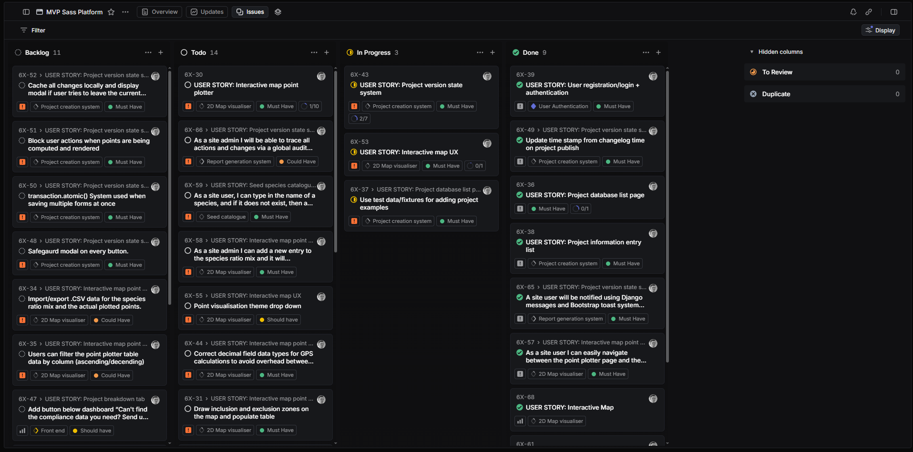

**Linear (Agile project management platform)**

[**Linear**](https://linear.app/) was used to manage the project agile development. The advantage of Linear over GitHub Projects is that tasks are easier to create and manage due to the intuitive UX.

For example this user story template was set up to automatically break the issue into the fields (User story: title, description, AC1, AC2 and AC3).
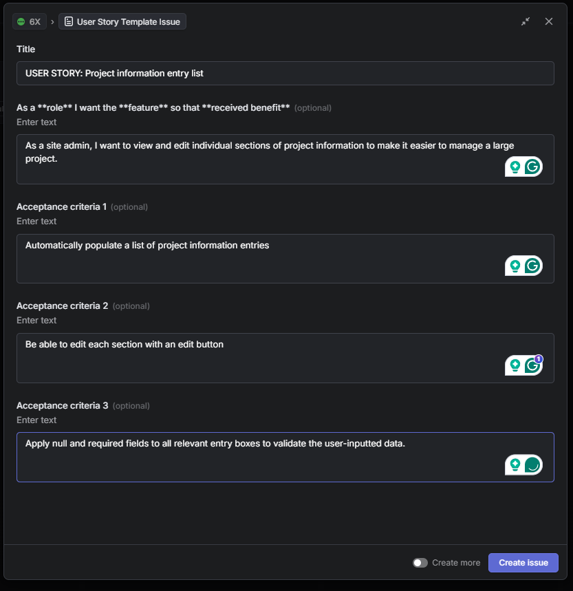

This automatically generates the issue.
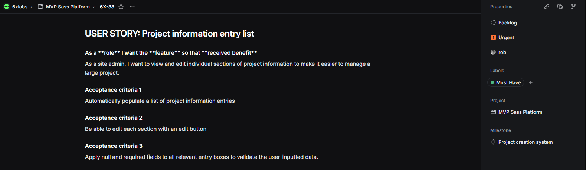

Various subtasks were assigned to larger issues when 3 acceptance criteria was not enough.
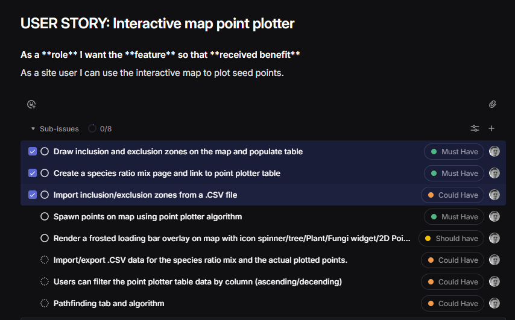

These can be hidden/unhidden using the "Show sub-issues" display flag. This kept the kanban board clean and easy to view.

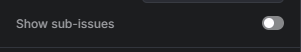
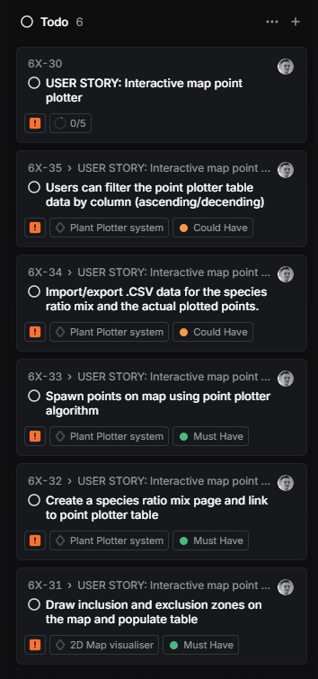

A copy of the linear issues can be found here on the repo Project page on 
[**Github**](https://github.com/users/RealTimeBasecamp/projects/2).

## Features
**Dashboard Page**

The dashboard page is the home page of the platform per user, it is set up as the redirect for login. The dashboard features working graphs that showcase breakdown information about the ongoing projects. In the future these graphs will be configured towards each user's specific projects and company carbon compliance information.

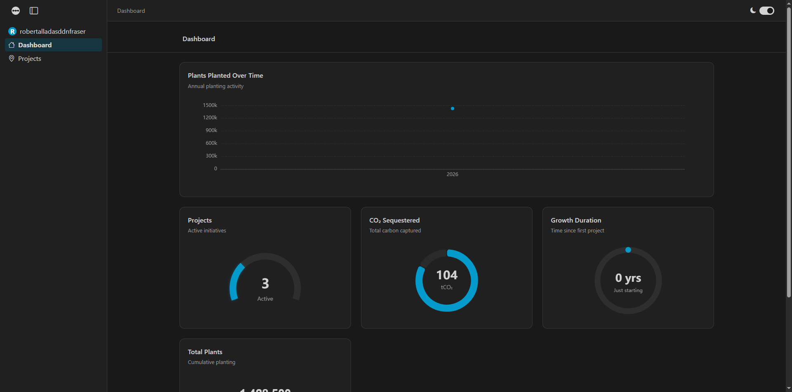

**Projects page**
 
The projects page provides users with a granular list or table view of the ongoing reforestation projects. Users can also sort projects by keywords using the search bar functionality. The table is also sortable by clicking on each heading. Only project owners, site staff or superusers will see the "actions" header in the table. This ensures projects cannot be deleted by the wrong users.
 
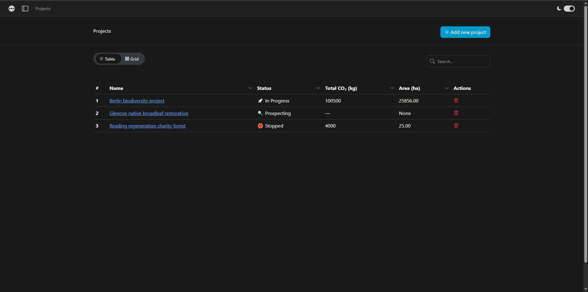
 

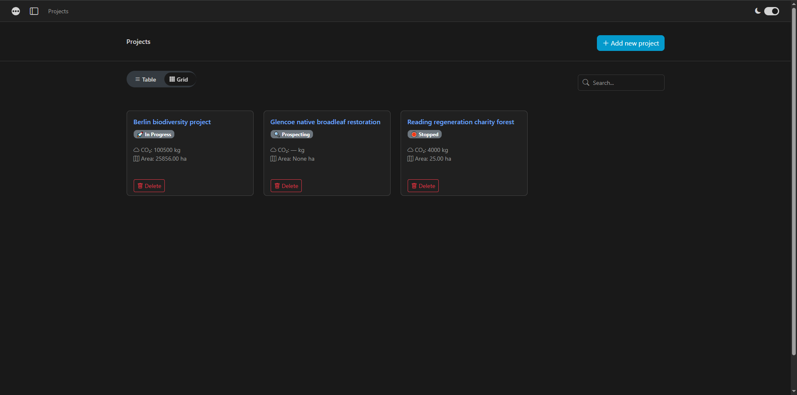
 

**Project planner page [Interactive 3D map]**
 
The project planner page automatically loads the project data and interactive map at the correct latitude and longitude. Projects can be navigated to by using the dropdown menu within the screen. This ensures the user does not need to go back to the projects list page. The "state management" actions bar in the top right is currently under development and is hidden from all non-staff and non-super users. In future updates users will be able to undo, redo, save a draft, discard their changes and publish drafts to the platform. The state management queue system was outside of the scope of the MVP for this project so has been omitted for normal users.

The interactive map has three modes with the sidebar (Sites, Zones and Point plotter). These modes are disabled for users currently as they are also under development. The intention is to allow users to draw out "sites" then draw out inclusion and exclusion zones within the site. Finally the point plotting system will spawn millions of points within the inclusion zones. The spawned points will be linked to a specific biodiversity species mix database.

**Map components**
 
- The map is rendered using [**MapLibre.**](https://maplibre.org/)
- The points are rendered using an [**Apache Echarts**](https://echarts.apache.org/en/index.html) layer on top of the MapLibre render pass.
- The additional tile data is rendered using OpenStreetMap ([**OSM**](https://tile.openstreetmap.org)).
- The additional terrain/shadow detail is rendered using [**Mapterhorn**](https://mapterhorn.com) (ESA Copernicus DEM, hosted on Cloudflare R2).

**Future updates**
 
The visualisations below are working "point plotting" algorithms that have been developed using various computer science Python libraries and rendered with Matplotlib. The long-term goals of the platform are to generate these points on the interactive map and save them per site and per project. After iterating on the points and collaborating with the relevant forestry commission these points can be sent to a drone for future seed dispersal.
 

The red areas are "exclusion" zones and the white area is the overall "site". The points are spawned inside the "inclusion" zones. These would be used to define viable land to plant trees.

Under the "Reading regeneration charity forest" project there is a hardcoded visualisation concept of how these points will be rendered. This is not an exposed feature for users.

**Project planner page [Project info section]**
 
All of the project data is rendered using grouped "cards". Each card has a related edit button and the data per card can be configured within the projects model for easy updating.

**Project planner page [Project breakdown section]**
 
The project breakdown section shows off the relevant data per project. All of the graphs automatically update when the page is loaded. Therefore long-term data can be studied as the reforestation project is updated.

**Project creation flow**
 
The "Add new project" button is triggered from any project/ sub page. This project creation flow is built using a custom wizard modal component that allows any forms to be integrated as "steps". Each step is a separate form to allow flexible and customisable pages for various user interaction. This wizard is also used for the user onboarding and is designed in an agnostic way, allowing any type of form to be used.

The wizard has two distinct modes, create and edit. The create mode omits autogenerated fields from each form. The edit mode loads existing data into the form and unhides autogenerated fields that are present within the project as to not confuse the user. The autogenerated fields are disabled as the user should not edit them manually.

Users can see the data within the project's info cards meaning they can edit specific groups of data at one time. The "card" they click on will automatically load the related edit form for that data group. This keeps data handling consistent across the site and user journey.

**Data displayed in project environment "card"**

**Editable data in project environment form**

**Project deletion flow**
 
Projects can be deleted using the delete wizard which is designed to safely delete projects. It uses a 2 step form with a project name confirmation field. The additional data shows the user on the second page to ensure the correct user is deleting the project for audit trails.

The danger zone card at the bottom of the project planner page is only exposed to staff, superusers or users who created the project.
  

**Sidebar**

The sidebar is a custom implementation of the Bootstrap offcanvas component. The sidebar has been extended to allow for custom "nav-item" functionality per user. Currently the user is only shown pages that are available on their current "tier" within their user profile. The navigation items and metadata are stored within a navigation.json file.

The sidebar has custom CSS and JS functionality which stores the current sidebar hidden/unhidden preference per user within their user config. This config preference persists between pages to ensure a smoother user experience.

The sidebar also has expandable nav item folders which is designed to make navigation easier. In the future the currently open folders will persist across pages. Here is an example of future pages that will be listed as sidebar items.
 

In mobile view the sidebar is rendered on top of the current page allowing easier selection by touch. This can be hidden/unhidden using the arrow in the top left.

**Navigation Bar**
 
The navigation bar is deliberately kept very simple and only includes breadcrumbs and the theme lightmode toggle. It is responsive to the sidebar being hidden/expanded. The sidebar button and 6x logo are automatically hidden/unhidden from the sidebar and nav components ensuring a smooth experience.
 
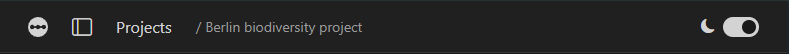
 
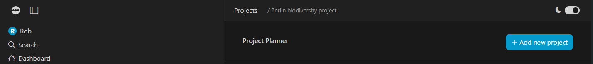

**The Footer**
 
The footer is a simple copyright notice applied to each page. This can be overridden using the footer template block.

**Sign Up**

The site allows users to register as a user. Users cannot access the site unless they are logged in with an authenticated account. All of the Django views have been defined with the @login_required decorator and mixin to ensure no users can bypass the login screen.
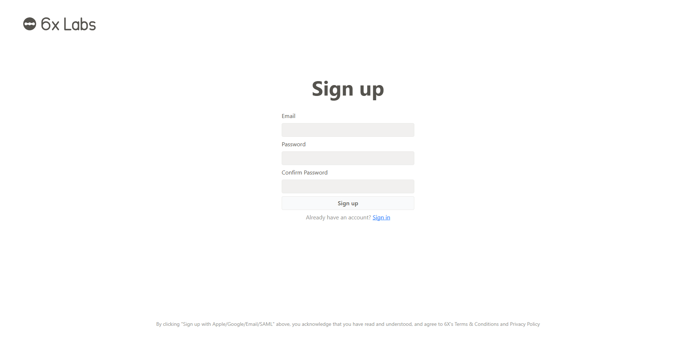

**Log In**

The site allows users to log in to already registered accounts. You are redirected to the dashboard upon login.

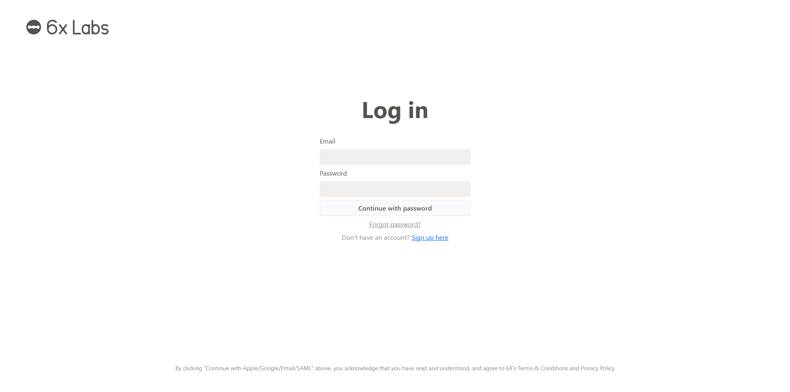

**Onboarding**
The site uses an onboarding form to capture and update the user's information. User Avatars are still WIP and the icon is currently disabled.
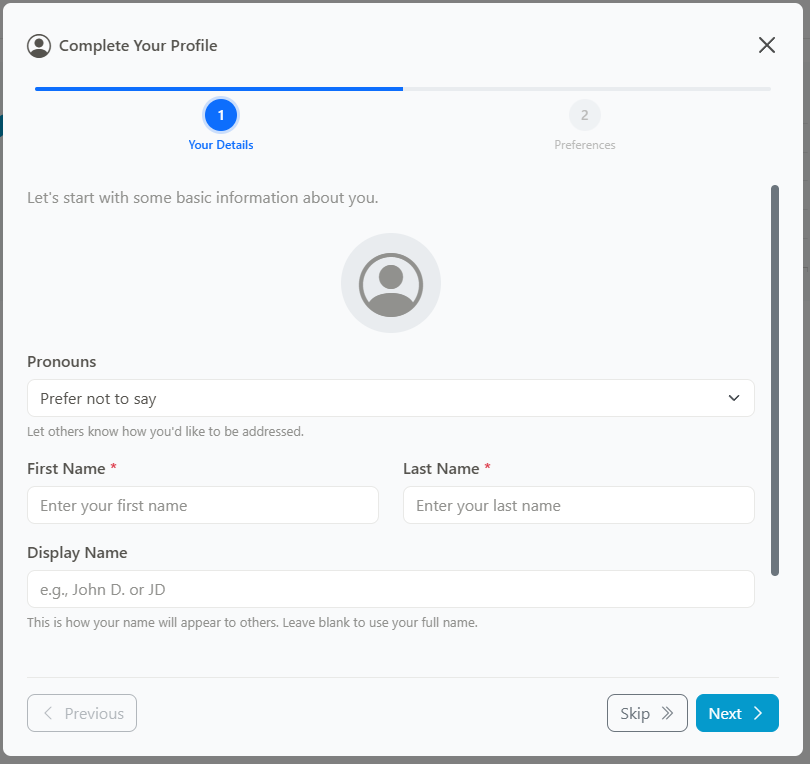
 

**Teamspace modal**

The site has a "teamspace" modal that can be opened via the sidebar by clicking on the user button. This shows the currently logged in user, their "subscription tier" or account status (Defaults to "Sapling" due to a lack of payment system integration), their email and display name. The user can log out via this modal.

The settings modal opens and allows users to update themes that were present during onboarding.

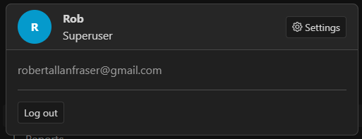

**Sign Out**

The site has a facility for a user to sign out of their account.
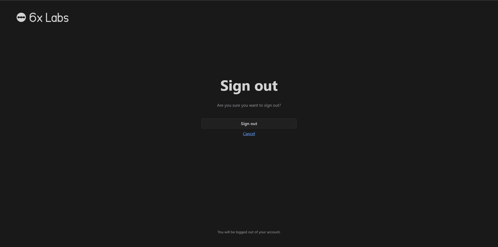
  

**Admin**

The site has a facility for designated administrators to sign in, in order to administrate the site via the standard Django admin interface.

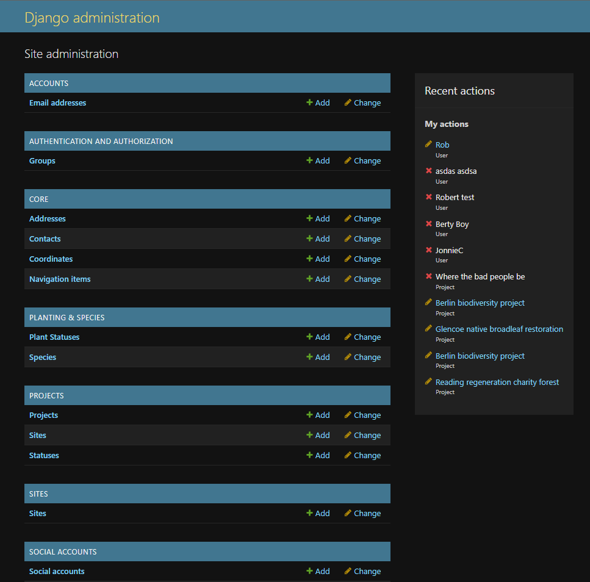

 

**Entity Relationship Diagram**
The following database schema ERD was created for the project.
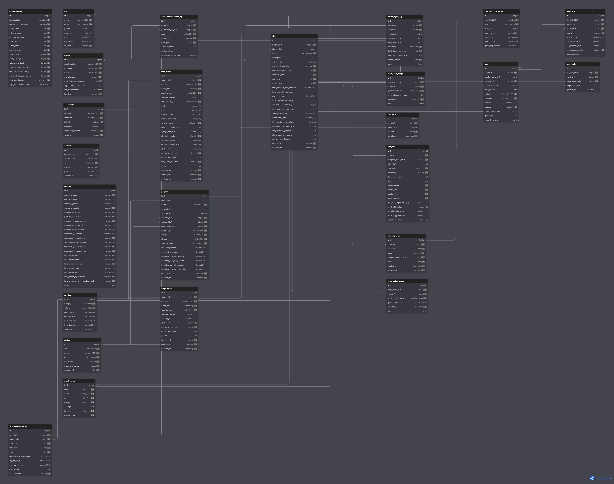

This is a simplified diagram explaining the core data models and how they relate. Not every table is currently integrated, the data structure has been generated to future-proof the development.

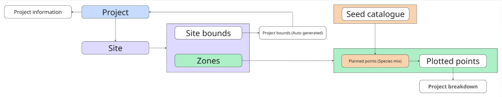

## Testing

### Manual Testing
The site was tested on the following browsers for compatibility:

### Chrome ###
|   Test	|  Expected Result 	|  Actual Result	|
|---	|---	|---	|
|   Click Home button (6x Labs logo)	|  Takes user to the dashboard 	|  success 	|
|   Click projects menu	|  Takes user to project list page 	|  success 	|
|   Click the project (Grid/Table) buttons	|  View project list as a grid of cubes instead of table 	|  success 	|
|   Click teamspace menu	|  Opens teamspace popout modal 	|  success 	|
|   Click settings button	|  Opens settings modal 	|  success 	|
|   Click Light/Dark mode toggle	|  Change theme modes between light/dark 	|  success 	|
|   Click the sidebar button	|  Hides/opens sidebar menu 	|  success 	|
|   Drag the sidebar	|  Expands/shrinks the sidebar menu 	|  success 	|
|   Click Logout	|  Logs the user out and returns to login page 	|  success 	|
|   Click individual project	|  Loads the project/slug page 	|  success 	|
|   Click Add new project	button |  Opens project creation modal 	|  success 	|
|   Click Edit button within a project field	|  Opens the edit wizard 	|  success 	|
|   Register new account	|  Creates the user and opens onboarding 	|  success 	|
|   Access admin interface	|  Opens the user admin interface 	|  success 	|
|   Responsivity	|  Mobile/screensizes view responsive 	|  Functional, Mobile needs improvement 	|

### Edge ###
|   Test	|  Expected Result 	|  Actual Result	|
|---	|---	|---	|
|   Click Home button (6x Labs logo)	|  Takes user to the dashboard 	|  success 	|
|   Click projects menu	|  Takes user to project list page 	|  success 	|
|   Click the project (Grid/Table) buttons	|  View project list as a grid of cubes instead of table 	|  success 	|
|   Click teamspace menu	|  Opens teamspace popout modal 	|  success 	|
|   Click settings button	|  Opens settings modal 	|  success 	|
|   Click Light/Dark mode toggle	|  Change theme modes between light/dark 	|  success 	|
|   Click the sidebar button	|  Hides/opens sidebar menu 	|  success 	|
|   Drag the sidebar	|  Expands/shrinks the sidebar menu 	|  success 	|
|   Click Logout	|  Logs the user out and returns to login page 	|  success 	|
|   Click individual project	|  Loads the project/slug page 	|  success 	|
|   Click Add new project	button |  Opens project creation modal 	|  success 	|
|   Click Edit button within a project field	|  Opens the edit wizard 	|  success 	|
|   Register new account	|  Creates the user and opens onboarding 	|  success 	|
|   Access admin interface	|  Opens the user admin interface 	|  success 	|
|   Responsivity	|  Mobile/screensizes view responsive 	|  Functional, Mobile needs improvement 	|	|

### Lighthouse
The site was tested using Lighthouse with the following results:
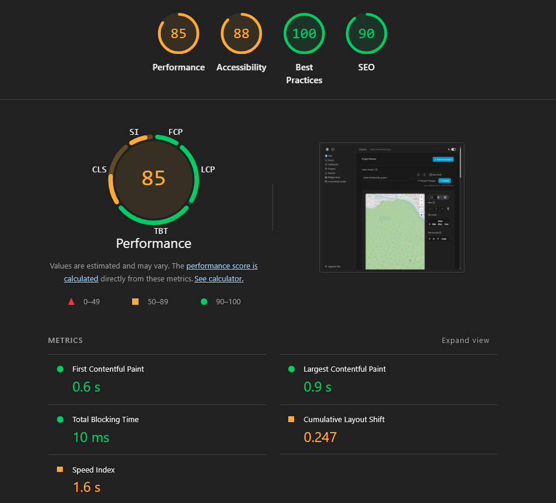

The performance losses are mainly caused by external CDN issues with Bootstrap icons and MapLibre.

### Responsive Testing

Alongside the built-in Bootstrap responsive CSS, Chrome dev tools were used frequently to test the site at standard screen sizes and the site was manually viewed on laptops, tablets and phones.

### Validator Testing

### HTML

0 errors were returned after checking the dashboard and project pages source HTML with the [**HTML**](https://validator.w3.org/) checker.
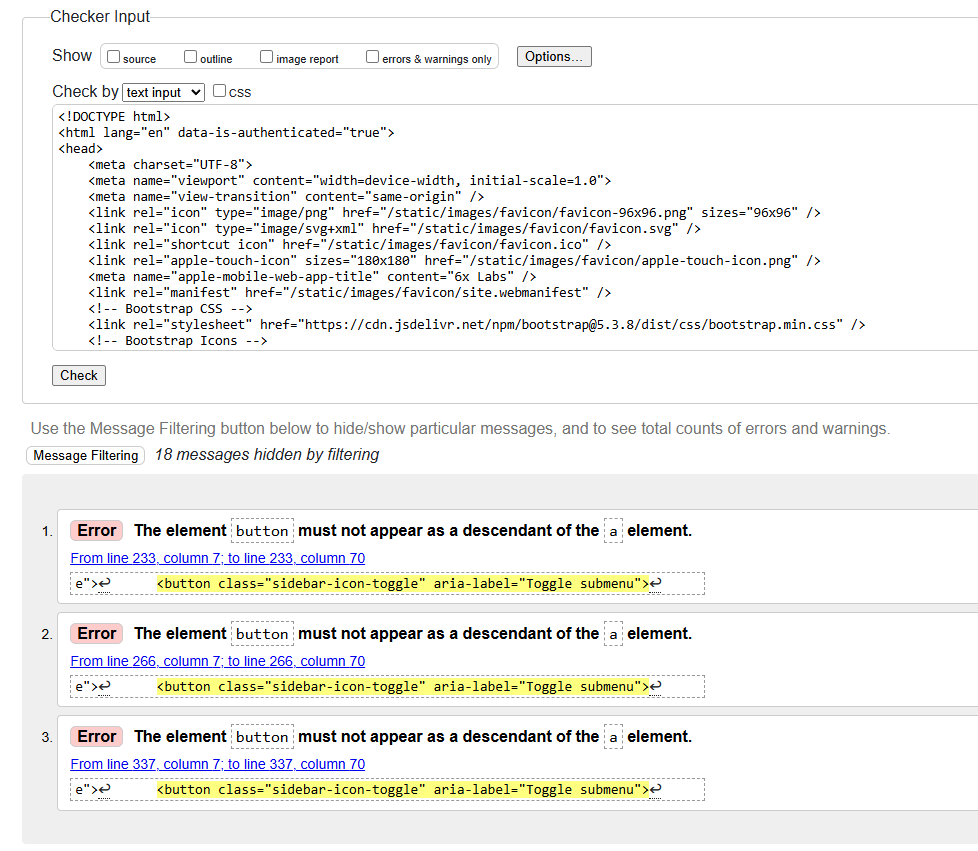

### CSS
0 CSS errors were found in the css files using the   [**W3C**](https://jigsaw.w3.org/css-validator/#validate_by_uri) CSS validator.
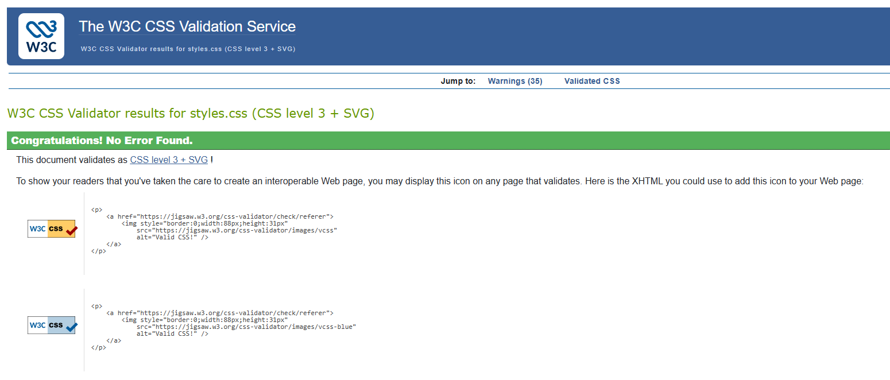

### Python (PEP 8)

All Python code was validated for PEP 8 compliance using a combination of VS Code extensions integrated into the development workflow:

**Pylance** - Microsoft's static type checker and language server was configured to run continuously during development, providing real-time feedback on:
- Import organisation and unused imports
- Variable naming conventions (snake_case for functions/variables, PascalCase for classes)
- Line length violations
- Indentation and whitespace issues
- Type hint suggestions

**Black Formatter** - The opinionated code formatter was run on all Python files to ensure consistent styling. Black enforces:
- Consistent line lengths (88 characters)
- Standardised string quote usage
- Proper spacing around operators and after commas
- Trailing comma formatting in multi-line structures

After each significant code change and prior to commits, all Python files were checked for linting errors. Any warnings or errors flagged by Pylance were resolved before proceeding. Black was then run to auto-format the code, ensuring uniform styling across the entire codebase.

### JavaScript (ESLint)

All JavaScript files were validated using ESLint configured within VS Code. The linter was run after each development session to catch:
- Undefined or unused variables
- Missing semicolons and inconsistent formatting
- Potential runtime errors (e.g., accessing properties on null/undefined)
- Best practice violations (var vs let/const usage)

Any issues identified were resolved before deployment to ensure clean, maintainable frontend code.

## AI Usage

AI was used throughout the project for both planning, implementation and debugging. Initially ChatGPT/Copilot was used within VS code but eventually Claude Code was used instead as it's more robust. The "Plan" mode was used throughout the project to understand the project architecture better and to make efficient use of view, model, template URL relationships. Using AI made it easier to find issues and debug them without endless hours googling problems. The Claude CLI integration was useful for live testing within the console. AI was also useful to convert my models from python to DBML format, which was used to generate the ERD diagram using dbdiagram.io.

### UX/UI improvements
Many CSS file improvements were implemented with AI to speed up the UX process. Figma AI was useful to generate the initial layout, then an screenshot or CSS reference could be provided to claude to recreate it.

### Performance
There were multiple times the code was refactored to improve performance and maintainability using ai. This was executed by adding in a file path and using the plan mode along with additional context about what performance improvements would be useful. AI was also used a way to test brute forcing security issues which would have been hard to implement manually without knowledge of cybersecurity backdoors.

### AI Influenced workflow
Once the AI process was proven to be useful it became a natural part of the workflow. It did not replace critical thinking but it did speed up the boilerplate creation process.

## Deployment

The site was deployed to Heroku from the main branch of the repository early in the development stage for continuous deployment and checking.

The Heroku app is setup with 3 environment variables, replacing the environment variables stored in env.py (which doesn't get pushed to GitHub).

In order to create a Heroku app:

1. Click on New in the Heroku dashboard, and Create new app from the menu dropdown.

2. Give your new app a unique name, and choose a region, preferably one that is geographically closest to you.

3. Click "Create app"

4. In your app settings, click on "Reveal Config Vars" and add the environment variables for your app. These are:
- DATABASE_URL - your database connection string
- SECRET_Key - the secret key for your app
- CLOUDINARY_URL - the cloudinary url for your image store

The PostgreSQL database is served from CI AWS postgres server.

Once the app setup is complete, click on the Deploy tab and:

1. connect to the required GitHub account
2. select the repository to deploy from
3. click the Deploy Branch button to start the deployment.
4. Once deployment finishes the app can be launched.

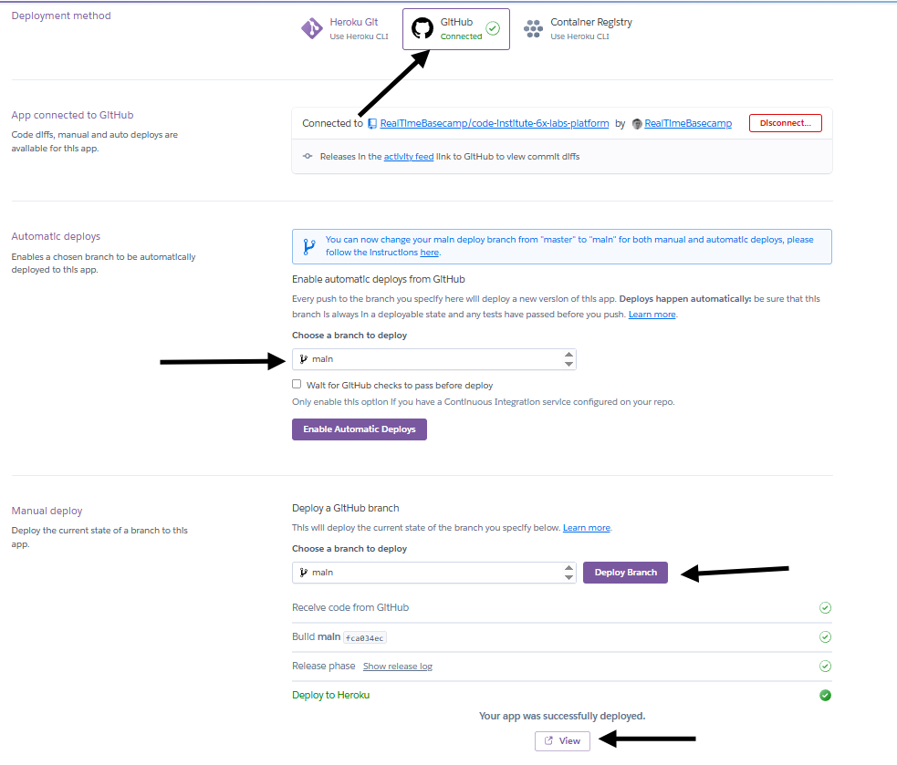

The live link can be found [_here_](https://sass-platform-909cf929c260.herokuapp.com/dashboard/)